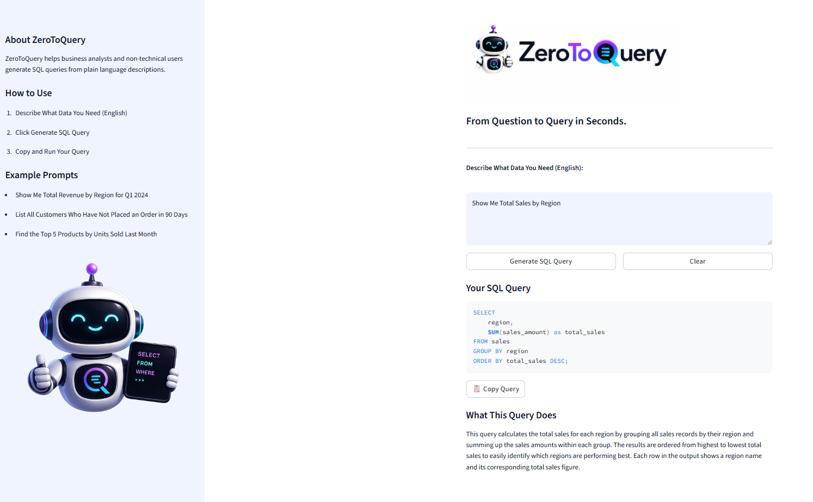

# ZeroToQuery

.png)

**From Question to Query in Seconds.**

ZeroToQuery is a web application that helps Business Analysts and non-technical users generate SQL queries from plain language descriptions. Users describe what data they need in everyday language, and ZeroToQuery instantly produces a ready-to-run SQL query along with a plain-English explanation of what the query does and why. Built with Claude and Streamlit, ZeroToQuery bridges the gap between business questions and database answers. No SQL knowledge required.

---

## Context, User, and Problem

Business Analysts and operations staff frequently need data to make decisions, but many do not have the SQL knowledge required to retrieve it themselves. This creates a bottleneck where non-technical users must wait for a Data Analyst or Engineer to write queries on their behalf, slowing down reporting cycles and decision making.

ZeroToQuery solves this problem by allowing any user to describe what data they need in plain language and receive a ready-to-run SQL query instantly. The target user is a business analyst, operations manager, or any professional who understands their data needs but lacks the technical skills to write SQL independently.

This problem is especially relevant in small and mid-sized organizations where dedicated data engineering support is limited and analysts are expected to be self-sufficient.

---

## Solution and Design

ZeroToQuery is built with Python and Streamlit for the frontend and uses the Anthropic Claude API as the language model backend.

The workflow is as follows:

1. The user describes what data they need in plain language using a text input field
2. The app sends the description to Claude along with a structured prompt that instructs it to return a SQL query and a plain English explanation
3. The response is parsed and displayed in two sections: the SQL query in a formatted code block and the explanation in plain text

The key design choices are:

- A single focused prompt that instructs Claude to return output in a consistent, parseable format
- Response parsing that cleanly separates the SQL query from the explanation
- A sidebar with example prompts to help new users get started quickly
- No database connection required, making the tool portable and easy to run locally

---

## Evaluation and Results

### Baseline

The baseline for this project is the current manual process: a non-technical user must either Google SQL syntax and attempt to write a query themselves, or submit a request to a data analyst and wait for a response. Both approaches are slow, error-prone, and create friction in reporting workflows.

### Test Cases

Five test cases were used to evaluate ZeroToQuery against the baseline:

| Test | Input | Result |
|---|---|---|
| 1 | Show me the top 10 customers by total sales in 2024 | Correct query using JOIN, GROUP BY, ORDER BY, and LIMIT |
| 2 | List all employees who have not taken any vacation days this year | Correct query using LEFT JOIN and IS NULL |
| 3 | Show me total revenue by region for each quarter in 2024 | Correct query using QUARTER function and GROUP BY |
| 4 | Show me the average order value by customer segment for the last 6 months | Correct query using AVG, DATE_SUB, and bonus COUNT |
| 5 | Show me which stores are doing well | Tool asked clarifying questions instead of guessing |

### What Worked

ZeroToQuery consistently produced accurate, well-structured SQL queries for clear and specific requests. The queries used appropriate techniques including JOINs, aggregate functions, date filters, and subqueries. Response time was under 5 seconds for all test cases. The plain English explanations were clear and accurate, making the output useful even for users who cannot read SQL.

### What Failed and Where a Human Should Stay Involved

Test case 5 demonstrated the primary limitation of ZeroToQuery. When a request is too vague, the tool asks clarifying questions rather than producing a query. While this is responsible behavior, it means the tool cannot fully replace human judgment for ambiguous requests.

Additionally, ZeroToQuery does not have access to the user's actual database schema. All table and column names in the generated queries are assumed based on the user's description. A human analyst should always review the output and adjust table and column names to match their actual database before running any query.

ZeroToQuery is best used as a starting point that accelerates the query writing process, not as a fully automated replacement for a skilled analyst.

---

## Artifact Snapshot

### Application Interface

### Sample Output

---

## Setup and Usage

### Requirements

- Python 3.8 or higher
- Anthropic API key

### Installation

1. Clone the repository: git clone https://github.com/desireevanderloop/ZeroToQuery.git
cd ZeroToQuery
2. Install dependencies: pip install -r requirements.txt
3. Create a .env file in the root directory and add your Anthropic API key: ANTHROPIC_API_KEY=your_api_key_here
4. Run the app: python -m streamlit run app.py

### Usage

1. Describe what data you need in plain language in the text box
2. Click Generate SQL Query
3. Copy the generated query and adjust table and column names to match your database
4. Run the query in your SQL environment