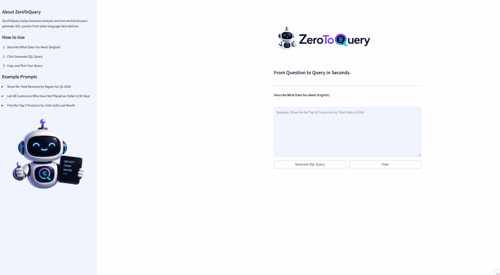
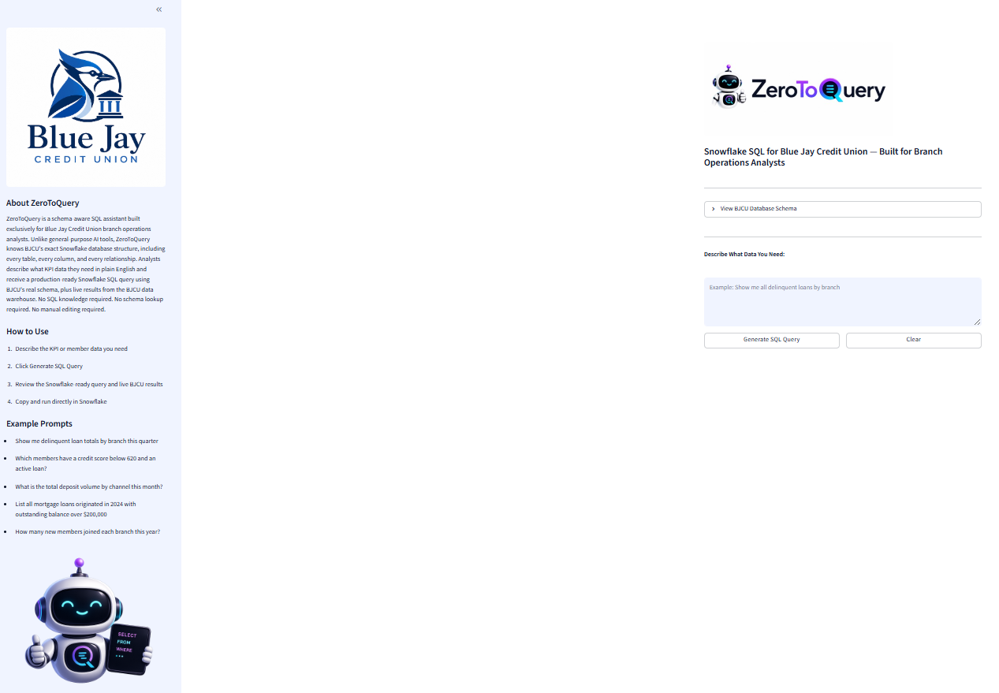
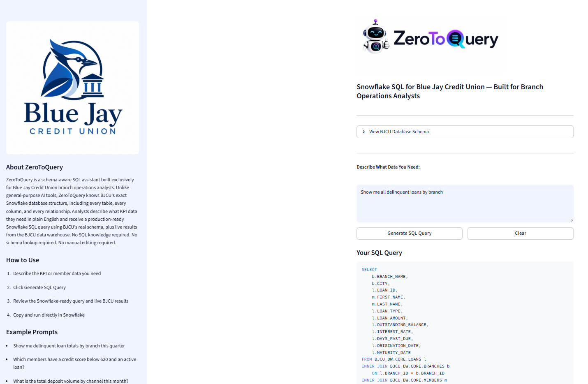
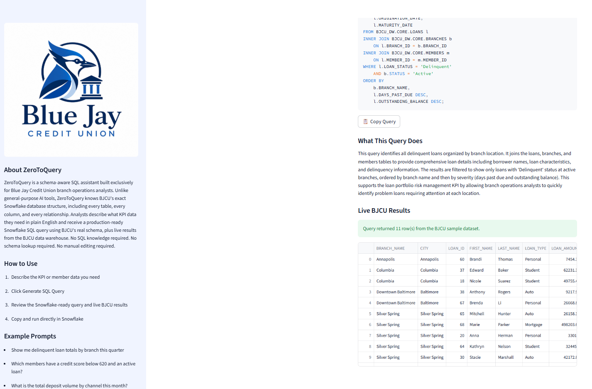
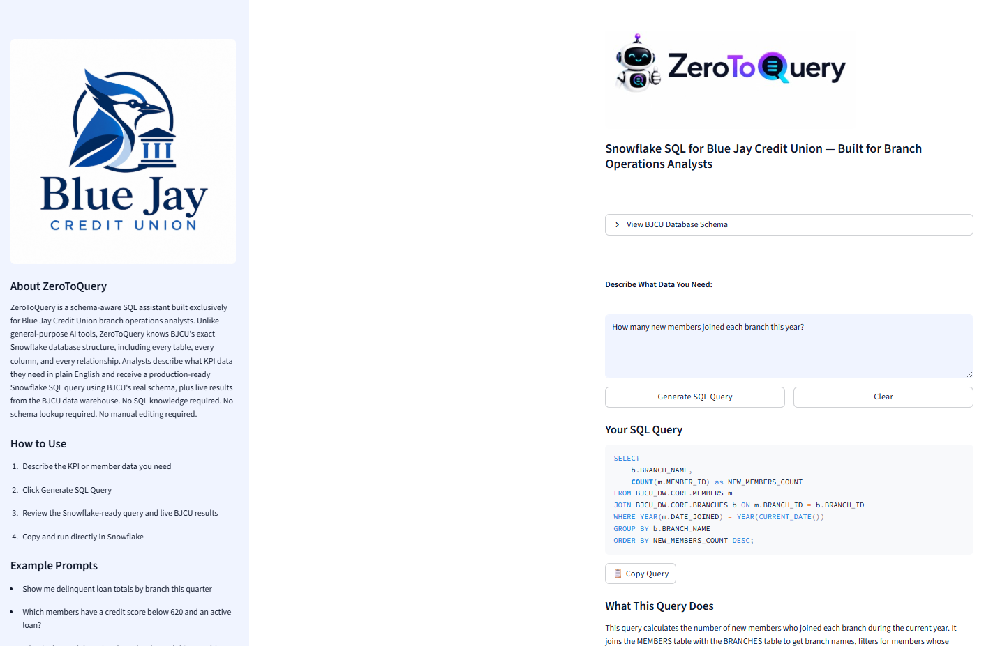
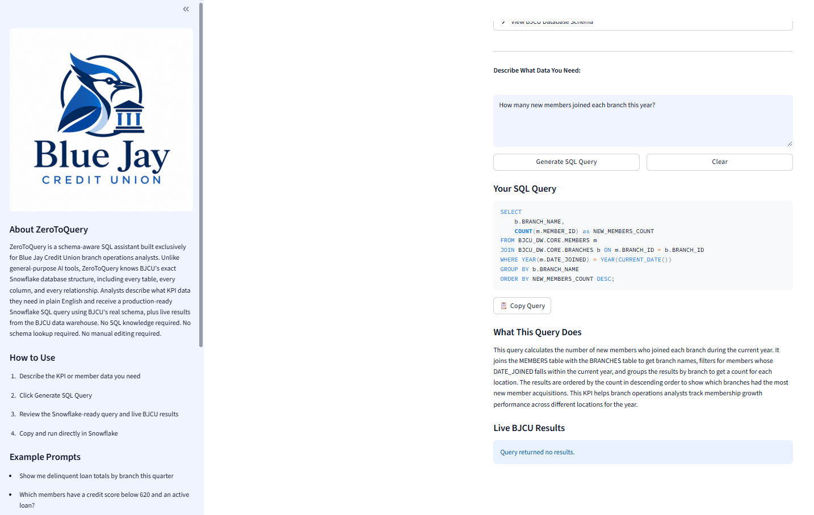

# ZeroToQuery

.png)

**Snowflake SQL for Blue Jay Credit Union — Built for Branch Operations Analysts**

ZeroToQuery is a schema-aware SQL assistant built exclusively for Blue Jay Credit Union branch operations analysts. Unlike general-purpose AI tools, ZeroToQuery knows BJCU's exact Snowflake database structure, including every table, every column, and every relationship. Analysts describe what KPI data they need in plain English and receive a production-ready Snowflake SQL query using BJCU's real schema, plus live results from the BJCU data warehouse. No SQL knowledge required. No schema lookup required. No manual editing required.

---

## Context, User, and Problem

Blue Jay Credit Union branch operations analysts are responsible for producing weekly KPI reports for executive leadership, including the Chief Operations Officer. These reports require pulling data on loan performance, member growth, account activity, and transaction volume from BJCU's Snowflake data warehouse every week.

The problem is that many operations staff and branch managers who need this data do not have the SQL skills to retrieve it themselves. When the assigned analyst is unavailable, no one else can run the queries. This creates a single point of failure in the reporting process that delays decision-making and puts pressure on a small number of technical staff.

Existing general-purpose AI tools like ChatGPT cannot solve this problem because they do not know BJCU's database schema. They invent table and column names that do not exist, producing queries that fail immediately when run in Snowflake. Every query still requires manual correction by someone who knows the schema, defeating the purpose.

ZeroToQuery solves this by embedding BJCU's complete Snowflake schema directly into the tool. When an analyst describes what data they need, ZeroToQuery generates a query using the exact table names, column names, and join relationships from BJCU's live data warehouse — and immediately runs it against the BJCU dataset to return real results. The output is ready to copy and run in Snowflake with no editing required.

---

## Solution and Design

ZeroToQuery is built with Python and Streamlit for the frontend, uses the Anthropic Claude API as the language model backend, and DuckDB as the local query engine for live result execution.

The workflow is as follows:

1. The analyst describes what KPI or member data they need in plain English
2. The app sends the request to Claude along with BJCU's complete Snowflake schema and strict rules to only use columns that exist in the schema
3. Claude generates a fully qualified Snowflake SQL query using BJCU_DW.CORE table references
4. The query is parsed, displayed, and automatically executed against the BJCU sample dataset using DuckDB
5. Live results are returned in a formatted data table below the query

The key design choices are:

- BJCU's complete 7-table Snowflake schema is embedded directly in the prompt, making every generated query schema-accurate and immediately runnable
- A strict prompt enforces that Claude only uses column names that exist in the schema, preventing hallucinated column names
- Snowflake fully qualified table names (BJCU_DW.CORE.TABLE_NAME) are used in every query so output is production-ready
- DuckDB executes queries locally against the BJCU sample dataset so analysts can validate results before running in Snowflake
- A schema viewer is built into the app so analysts can reference table structures without leaving the tool

---

## Evaluation and Results

### Baseline

The baseline for this project is the current manual process: a branch operations analyst must either write the SQL query themselves, ask a data engineer to write it, or attempt to use a general-purpose AI tool like ChatGPT. All three approaches have significant limitations. Writing queries manually requires SQL expertise. Waiting on a data engineer creates bottlenecks. Using ChatGPT produces queries with invented table and column names that fail in Snowflake and require manual correction.

### Test Cases

Five test cases were used to evaluate ZeroToQuery against the baseline:

| Test | Input | Result |
|---|---|---|
| 1 | Show me all delinquent loans by branch | Correct Snowflake query using JOIN across LOANS, MEMBERS, and BRANCHES with accurate column names and live results returned |
| 2 | How many new members joined each branch this year | Correct query using DATE_TRUNC, COUNT, GROUP BY, and JOIN to BRANCHES with live results returned |
| 3 | What is the total outstanding loan balance by loan type | Correct query using SUM, GROUP BY, and ORDER BY with live results returned |
| 4 | List all members with a credit score below 620 who have an active loan | Correct query using JOIN across MEMBERS and LOANS with WHERE filter and live results returned |
| 5 | Show me total deposit volume by channel this month | Correct query using SUM, WHERE on TRANSACTION_TYPE and TRANSACTION_DATE, GROUP BY CHANNEL with live results returned |

### What Worked

ZeroToQuery consistently produced accurate, schema-compliant Snowflake SQL queries for all five test cases. Every query used correct BJCU table and column names, proper fully qualified Snowflake references, and appropriate SQL techniques including JOINs, aggregate functions, date filters, and GROUP BY clauses. Live results were returned from the BJCU dataset for all five queries. Response time was under 5 seconds for all test cases.

### What Failed and Where a Human Should Stay Involved

ZeroToQuery performs well for structured, data-driven requests but has two important limitations.

First, the tool relies on a sample dataset for live results. In a production deployment, it would connect directly to BJCU's Snowflake instance. Analysts should treat the sample results as validation of query logic rather than live production data.

Second, highly complex multi-step analytical requests may require a senior analyst to review and refine the generated query before running it in production. ZeroToQuery is designed to accelerate the query writing process and eliminate schema errors, not to replace analyst judgment entirely.

---

## Artifact Snapshot

### Demo

### Application Interface

### Sample Output - Delinquent Loans by Branch

### Sample Output - New Members by Branch

### ZeroToQuery Mascot
The ZeroToQuery bot mascot appears in the sidebar, representing the tool's mission to make SQL accessible to everyone.

---

## Setup and Usage

### Requirements

- Python 3.8 or higher
- Anthropic API key

### Installation

1. Clone the repository: git clone https://github.com/desireevanderloop/ZeroToQuery.git
cd ZeroToQuery
2. Install dependencies: pip install -r requirements.txt
3. Create a .env file in the root directory and add your Anthropic API key: ANTHROPIC_API_KEY=your_api_key_here
4. Run the app: python -m streamlit run app.py

### Usage

1. Describe what KPI or member data you need in the text box
2. Click Generate SQL Query
3. Review the Snowflake-ready query and live BJCU results
4. Copy the query and run it directly in your Snowflake environment

---

## Future Improvements

- **Direct Snowflake Connection** — Connect directly to BJCU's live Snowflake instance so results reflect real-time production data
- **Query History** — Save and display recent queries within a session so analysts can reference or reuse previous results
- **Query Validation** — Add a layer that checks generated queries for common syntax errors before displaying them to the analyst
- **Export to Excel** — Allow analysts to download query results directly to Excel for weekly KPI report workflows
- **Natural Language Follow-up** — Allow analysts to refine a generated query by describing changes in plain English without starting over
- **Additional Schema Support** — Expand to support other BJCU data sources including the core banking system and CRM

---

## Built With

- [Python](https://www.python.org/)
- [Streamlit](https://streamlit.io/)
- [Anthropic Claude API](https://www.anthropic.com/)
- [DuckDB](https://duckdb.org/)
- [python-dotenv](https://pypi.org/project/python-dotenv/)